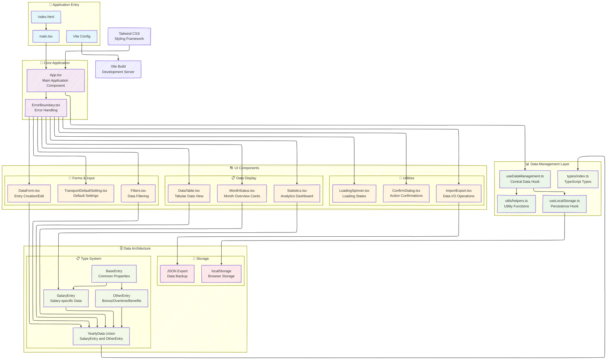
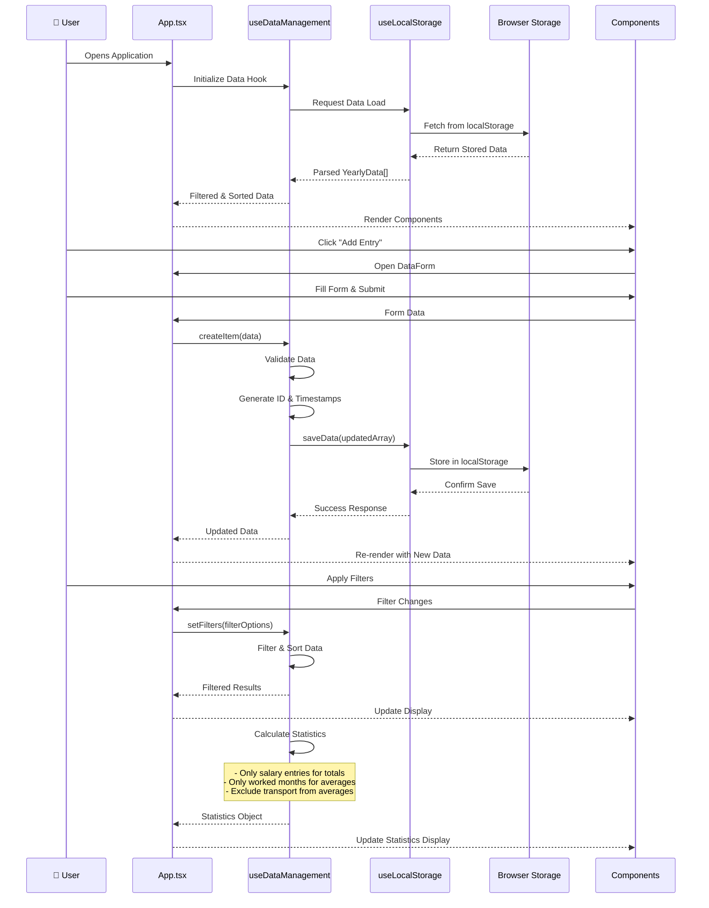
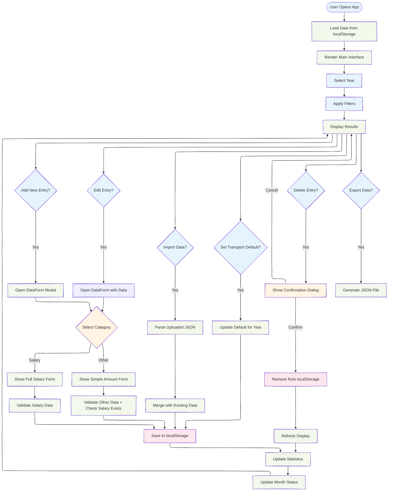
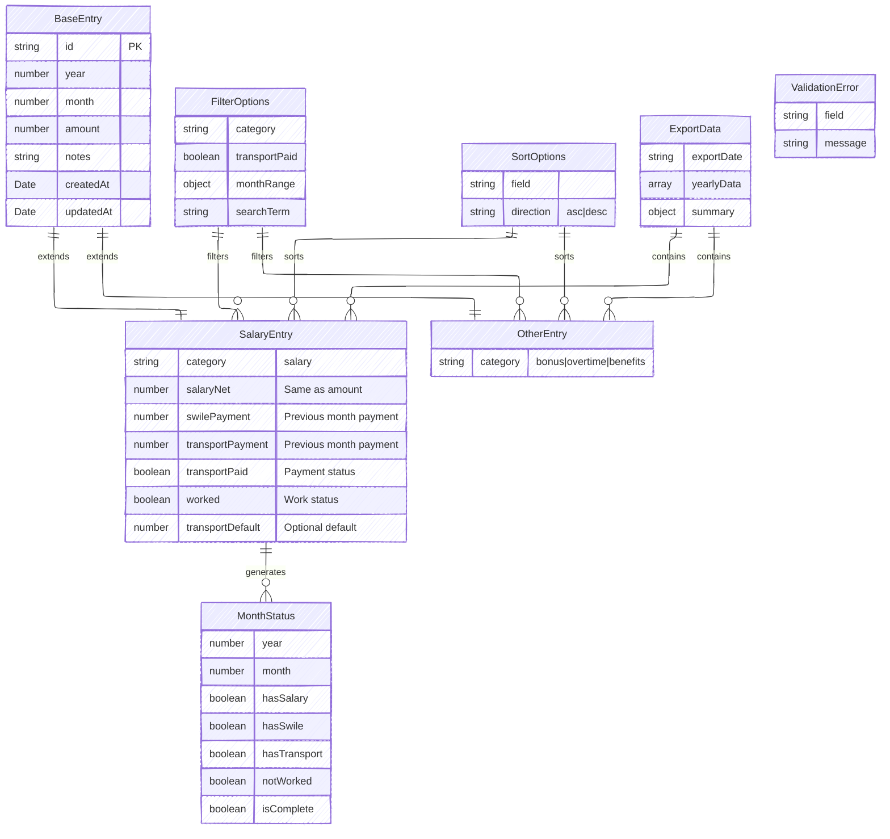
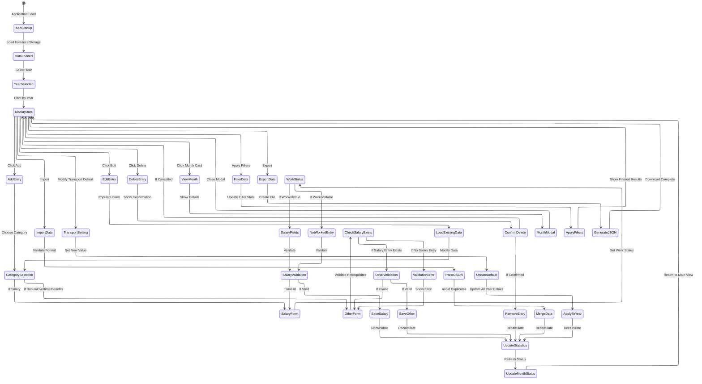
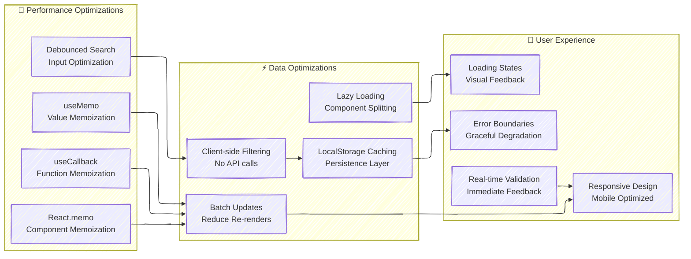

# Salary Management System - Complete Architecture

## System Overview Diagram



## Data Flow Architecture



## Component Interaction Flow



## Type System Architecture



## Business Logic Flow


## Performance & Optimization



## Technology Stack

```mermaid
---
config:
  layout: elk
  look: handDrawn
  theme: mc
---v
graph TB
    subgraph "🏗️ Development Stack"
        subgraph "Frontend"
            REACT[React 18.3.1<br/>UI Library]
            TS[TypeScript 5.5.3<br/>Type Safety]
            VITE_BUILD[Vite 5.4.2<br/>Build Tool]
        end
        
        subgraph "Styling"
            TAILWIND[Tailwind CSS 3.4.1<br/>Utility-first CSS]
            LUCIDE[Lucide React 0.344.0<br/>Icon Library]
            RESPONSIVE[Responsive Design<br/>Mobile-first]
        end
        
        subgraph "Development Tools"
            ESLINT[ESLint 9.9.1<br/>Code Linting]
            POSTCSS[PostCSS 8.4.35<br/>CSS Processing]
            AUTOPREFIXER[Autoprefixer 10.4.18<br/>CSS Compatibility]
        end
        
        subgraph "Data & Storage"
            LOCALSTORAGE[Browser localStorage<br/>Data Persistence]
            JSON_FORMAT[JSON Export/Import<br/>Data Portability]
            CLIENT_STATE[Client-side State<br/>No External DB]
        end
    end
    
    REACT --> TS
    TS --> VITE_BUILD
    TAILWIND --> POSTCSS
    POSTCSS --> AUTOPREFIXER
    LUCIDE --> REACT
    ESLINT --> TS
    LOCALSTORAGE --> JSON_FORMAT
    JSON_FORMAT --> CLIENT_STATE
```

This comprehensive Mermaid diagram system provides a complete overview of the Salary Management System, including:

1. **System Overview**: High-level architecture and component relationships
2. **Data Flow**: Sequence diagrams showing user interactions and data flow
3. **Component Interactions**: Detailed flowchart of user actions and system responses
4. **Type System**: Entity-relationship diagram of the data structure
5. **Business Logic**: State machine showing application states and transitions
6. **Feature Analysis**: Mind map of system complexity and features
7. **Performance**: Optimization strategies and techniques
8. **Technology Stack**: Complete development and runtime environment

The system demonstrates a sophisticated multi-category financial management application with type-safe operations, intelligent validation, and a modern React architecture.