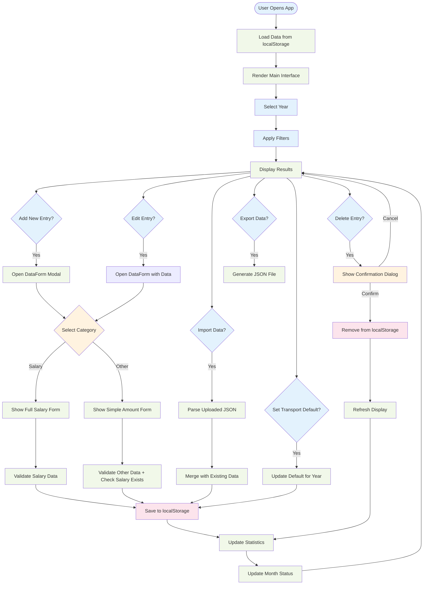
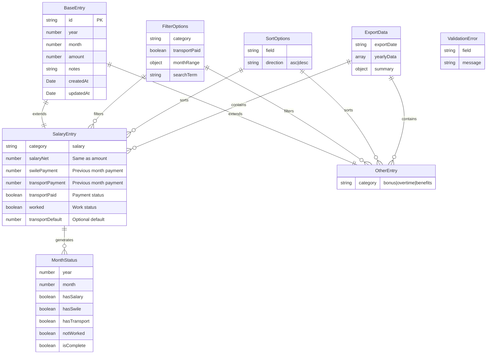
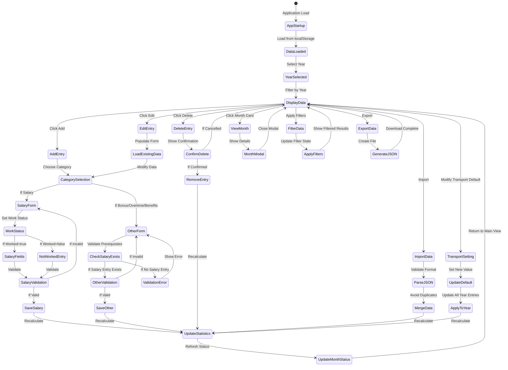
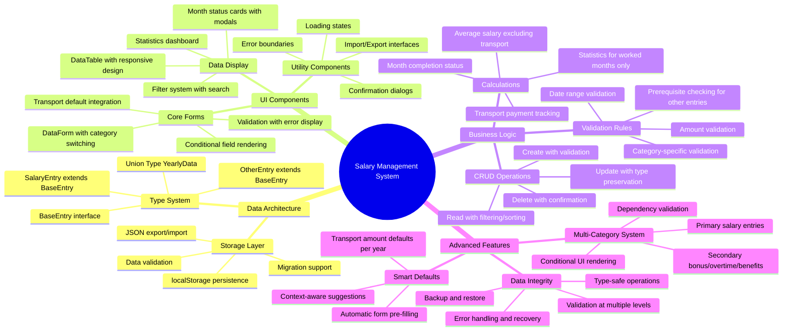

# Salary Management System - Complete Architecture

## System Overview Diagram

```mermaid
graph TB
    %% Application Entry Point
    subgraph "🚀 Application Entry"
        HTML[index.html]
        MAIN[main.tsx]
        VITE[Vite Config]
    end

    %% Core Application Layer
    subgraph "🎯 Core Application"
        APP[App.tsx<br/>Main Application Component]
        EB[ErrorBoundary.tsx<br/>Error Handling]
    end

    %% Data Management Layer
    subgraph "📊 Data Management Layer"
        HOOK[useDataManagement.ts<br/>Central Data Hook]
        LOCAL[useLocalStorage.ts<br/>Persistence Hook]
        TYPES[types/index.ts<br/>TypeScript Types]
        HELPERS[utils/helpers.ts<br/>Utility Functions]
    end

    %% Component Architecture
    subgraph "🏗️ UI Components"
        %% Form Components
        subgraph "📝 Forms & Input"
            FORM[DataForm.tsx<br/>Entry Creation/Edit]
            FILTERS[Filters.tsx<br/>Data Filtering]
            TRANSPORT[TransportDefaultSetting.tsx<br/>Default Settings]
        end
        
        %% Display Components
        subgraph "📋 Data Display"
            TABLE[DataTable.tsx<br/>Tabular Data View]
            STATS[Statistics.tsx<br/>Analytics Dashboard]
            MONTH[MonthStatus.tsx<br/>Month Overview Cards]
        end
        
        %% Utility Components
        subgraph "🔧 Utilities"
            IMPORT[ImportExport.tsx<br/>Data I/O Operations]
            CONFIRM[ConfirmDialog.tsx<br/>Action Confirmations]
            SPINNER[LoadingSpinner.tsx<br/>Loading States]
        end
    end

    %% Data Storage & Types
    subgraph "🗄️ Data Architecture"
        subgraph "📋 Type System"
            BASE[BaseEntry<br/>Common Properties]
            SALARY[SalaryEntry<br/>Salary-specific Data]
            OTHER[OtherEntry<br/>Bonus/Overtime/Benefits]
            UNION[YearlyData Union<br/>SalaryEntry | OtherEntry]
        end
        
        subgraph "💾 Storage"
            BROWSER[localStorage<br/>Browser Storage]
            JSON[JSON Export<br/>Data Backup]
        end
    end

    %% Data Flow Connections
    HTML --> MAIN
    MAIN --> APP
    APP --> EB
    EB --> FORM
    EB --> TABLE
    EB --> STATS
    EB --> MONTH
    EB --> FILTERS
    EB --> TRANSPORT
    EB --> IMPORT
    EB --> CONFIRM
    EB --> SPINNER
    
    %% Data Management Connections
    APP --> HOOK
    HOOK --> LOCAL
    HOOK --> HELPERS
    LOCAL --> BROWSER
    IMPORT --> JSON
    
    %% Type System Connections
    BASE --> SALARY
    BASE --> OTHER
    SALARY --> UNION
    OTHER --> UNION
    UNION --> TYPES
    
    %% Component to Data Connections
    FORM --> UNION
    TABLE --> UNION
    STATS --> SALARY
    MONTH --> UNION
    FILTERS --> UNION
    
    %% Styling & Build
    CSS[Tailwind CSS<br/>Styling Framework]
    BUILD[Vite Build<br/>Development Server]
    
    VITE --> BUILD
    CSS --> APP
    
    %% Color coding
    classDef entryPoint fill:#e1f5fe
    classDef core fill:#f3e5f5
    classDef dataLayer fill:#e8f5e8
    classDef components fill:#fff3e0
    classDef storage fill:#fce4ec
    classDef types fill:#f1f8e9
    
    class HTML,MAIN,VITE entryPoint
    class APP,EB core
    class HOOK,LOCAL,HELPERS dataLayer
    class FORM,TABLE,STATS,MONTH,FILTERS,TRANSPORT,IMPORT,CONFIRM,SPINNER components
    class BROWSER,JSON storage
    class BASE,SALARY,OTHER,UNION,TYPES types
```

## Data Flow Architecture


## Component Interaction Flow



## Type System Architecture



## Business Logic Flow



## Feature Complexity Analysis



## Performance & Optimization

```mermaid
graph LR
    subgraph "🚀 Performance Optimizations"
        MEMO[React.memo<br/>Component Memoization]
        CALLBACK[useCallback<br/>Function Memoization]
        USEMEMO[useMemo<br/>Value Memoization]
        DEBOUNCE[Debounced Search<br/>Input Optimization]
    end
    
    subgraph "⚡ Data Optimizations"
        FILTER[Client-side Filtering<br/>No API calls]
        LAZY[Lazy Loading<br/>Component Splitting]
        CACHE[LocalStorage Caching<br/>Persistence Layer]
        BATCH[Batch Updates<br/>Reduce Re-renders]
    end
    
    subgraph "🎯 User Experience"
        LOADING[Loading States<br/>Visual Feedback]
        ERROR[Error Boundaries<br/>Graceful Degradation]
        RESPONSIVE[Responsive Design<br/>Mobile Optimized]
        VALIDATION[Real-time Validation<br/>Immediate Feedback]
    end
    
    MEMO --> BATCH
    CALLBACK --> BATCH
    USEMEMO --> BATCH
    DEBOUNCE --> FILTER
    FILTER --> CACHE
    LAZY --> LOADING
    CACHE --> ERROR
    BATCH --> RESPONSIVE
    VALIDATION --> RESPONSIVE
```



## Technology Stack

```mermaid
graph TB
    subgraph "🏗️ Development Stack"
        subgraph "Frontend"
            REACT[React 18.3.1<br/>UI Library]
            TS[TypeScript 5.5.3<br/>Type Safety]
            VITE_BUILD[Vite 5.4.2<br/>Build Tool]
        end
        
        subgraph "Styling"
            TAILWIND[Tailwind CSS 3.4.1<br/>Utility-first CSS]
            LUCIDE[Lucide React 0.344.0<br/>Icon Library]
            RESPONSIVE[Responsive Design<br/>Mobile-first]
        end
        
        subgraph "Development Tools"
            ESLINT[ESLint 9.9.1<br/>Code Linting]
            POSTCSS[PostCSS 8.4.35<br/>CSS Processing]
            AUTOPREFIXER[Autoprefixer 10.4.18<br/>CSS Compatibility]
        end
        
        subgraph "Data & Storage"
            LOCALSTORAGE[Browser localStorage<br/>Data Persistence]
            JSON_FORMAT[JSON Export/Import<br/>Data Portability]
            CLIENT_STATE[Client-side State<br/>No External DB]
        end
    end
    
    REACT --> TS
    TS --> VITE_BUILD
    TAILWIND --> POSTCSS
    POSTCSS --> AUTOPREFIXER
    LUCIDE --> REACT
    ESLINT --> TS
    LOCALSTORAGE --> JSON_FORMAT
    JSON_FORMAT --> CLIENT_STATE
```



This comprehensive Mermaid diagram system provides a complete overview of the Salary Management System, including:

1. **System Overview**: High-level architecture and component relationships
2. **Data Flow**: Sequence diagrams showing user interactions and data flow
3. **Component Interactions**: Detailed flowchart of user actions and system responses
4. **Type System**: Entity-relationship diagram of the data structure
5. **Business Logic**: State machine showing application states and transitions
6. **Feature Analysis**: Mind map of system complexity and features
7. **Performance**: Optimization strategies and techniques
8. **Technology Stack**: Complete development and runtime environment

The system demonstrates a sophisticated multi-category financial management application with type-safe operations, intelligent validation, and a modern React architecture.